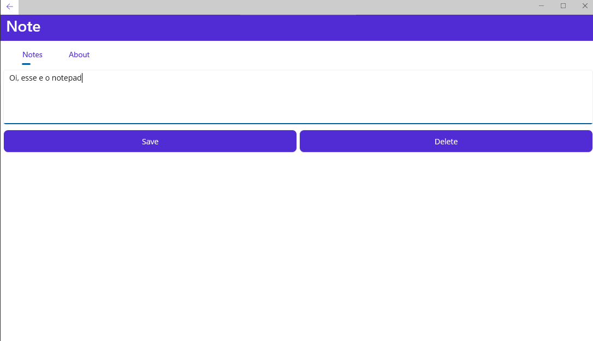
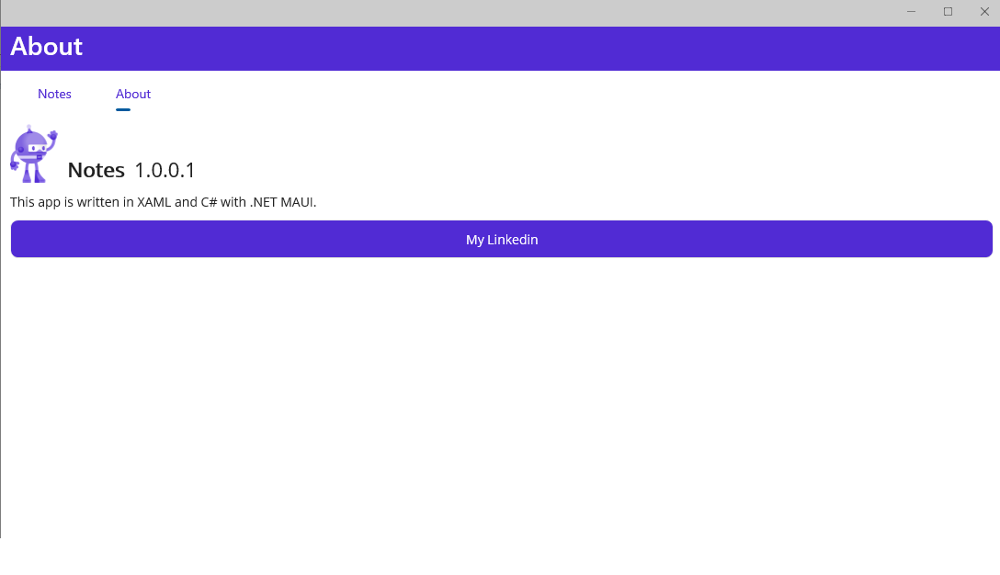

# Notepad-App
Note taking app made with MAUI

EN/US - 
This is a .NET Multi-platform App UI (.NET MAUI) app that only uses cross-platform code. Meaning, the code i wrote won't be specific to Windows, Android, iOS, or macOS.
The app i created is a note taking app, where the user can create, save, and load multiple notes.

BR/PT - 
Isso é um Applicativo .NET Multi-Plataforma UI (.NET MAUI) que usa apenas código multiplataforma. Isso significa que o código que eu escrevi não será específico para o Windows, Android, IOS ou macOS.
O aplicativo que eu criei é um aplicativo de anotações onde o usuário pode criar, salvar e carregar várias notas.

FR - 
Ceci est une application Multi-Plateformes UI (.NET MAUI) qui utilise seulement des codes cross-platform. Cela signifie que le code que j'ai écrit ne sera pas spécifiquement fait pour Windows, Android, IOS ou macOS.
L'application que j'ai créé est un Bloc-Note oú l'utilisateur peut créer, sauvegarder, et charger plusieurs notes.

<h2>Programming Languages and Technologies</h2>

  
<li>
C# - .NET Core 6 - RazorPage
</li>
<li>
XML
</li>

